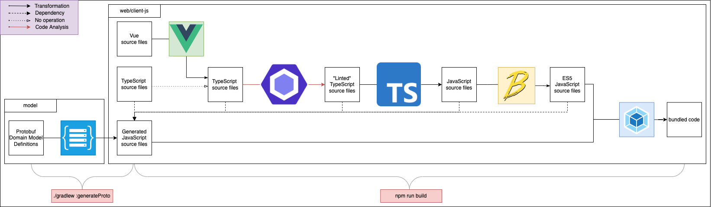

# Spine Vue client setup

## Prerequisites

- Create a Vue client in a separate submodule following this [guide](https://cli.vuejs.org/guide/creating-a-project.html#vue-create).
Ensure to include Typescript, ESLint, Babel.
- Go through this [guide](https://spine.io/docs/guides/gradle). As a result, it is
possible to run the following command:

```Bash
./gradlew :generateProto
./gradlew :generateJsonParsers
```

This command results in `protoc`-generated code under the `generated/main/js`
directory in the client submodule("project" from here on).

- Install the [`spine-web`](https://www.npmjs.com/package/spine-web) and 
[`tsconfig-paths-webpack-plugin`](https://www.npmjs.com/package/tsconfig-paths-webpack-plugin) 
in the project.

## Introduction

The code in a Vue client goes through various stages during the build process. Here is 
a diagram to visualize these stages:



Some of these stages require a non-default configuration provided in this guide.

## Instructions

If any of the mentioned configuration files do not exist, assume they should be created.
Also, consider that configuration files are located in the project's root directory
if not mentioned otherwise.

### ESLint

There is no need to analyze generated code, so add the following configuration to 
the `.eslintrc.json`:

```JSON
{
    "ignorePatterns": ["generated"]
}
```

As generated code is ignored, ESLint cannot know about the 'proto' namespace, which 
results in the `'proto' namespace is undefined` error. Considering that, the [`no-undef`](https://eslint.org/docs/latest/rules/no-undef) 
rule should be turned off by adding the following configuration to the `.eslintrc.json`:

```JSON
{
    "rules": {
        "no-undef": "off"
    }
}
```

### TypeScript

As generated code is JavaScript, JS files should be allowed to be a part of the program
by adding the following configuration to the `tsconfig.json`:

```JSON
{
  "allowJs": true
}
```

Also, the Typescript compiler should be instructed on resolving imports. Add to the
`compileOptions` section the following configuration:

```JSON
{
  "baseUrl": ".",
  "compileOptions": {
    "paths": {
      "@/*": [
        "<Path to non-generated source files>/*"
      ],
      "proto/*": [
        "generated/main/js/*"
      ]
    }
  }
}
```

Pay attention to the `baseUrl` setting as the `paths` is relative to it. `"baseUrl": "."`
represents the directory where the `tsconfig.json` is located. Also, make sure that the 
`include` setting does include generated source files or is not present at all.

### Babel

Exclude generated code from being transpiled to ES5 as it is already ES5. Add the
following configuration to the `babel.config.json`:

```JSON
{
    "exclude": ["./generated"]
}
```

### Webpack

Webpack should be instructed on how to resolve imports during bundling. Add the 
following configuration to the `webpack.config.js`:

```JavaScript
const TsconfigPathsPlugin = require("tsconfig-paths-webpack-plugin");

module.exports = {
    resolve: {
        plugins: [
            new TsconfigPathsPlugin({
                extensions: [".js", ".ts"]
            })
        ]
    },
};
```

The `TsconfigPathsPlugin` is used to avoid repeating the `paths` configuration from
the `tsconfig.json`.

The `webpack.config.js` should be passed to Vue by adding the following configuration 
to the `vue.config.js`:

```JavaScript
const webpackConfig = require('./webpack.config.js');
const { defineConfig } = require("@vue/cli-service");

module.exports = defineConfig({
    //...
    configureWebpack: {
        ...webpackConfig,
    }
});
```

## Using generated types

Add an import of the `index.js` generated by the `protoc` to the `App.vue`.

```Javascript
import "proto/index";
```

From here on, generated types can be found under the `proto` namespace. Here is an example:

```TypeScript
// types.ts
export type Card = proto.spine.examples.kanban.Card;
//...
```

```TypeScript
// anywhere.ts
import { Card } from "@/types"

let card: Card = new proto.spine.examples.kanban.Card();
card.setName("Awesome card!");
//...
```
